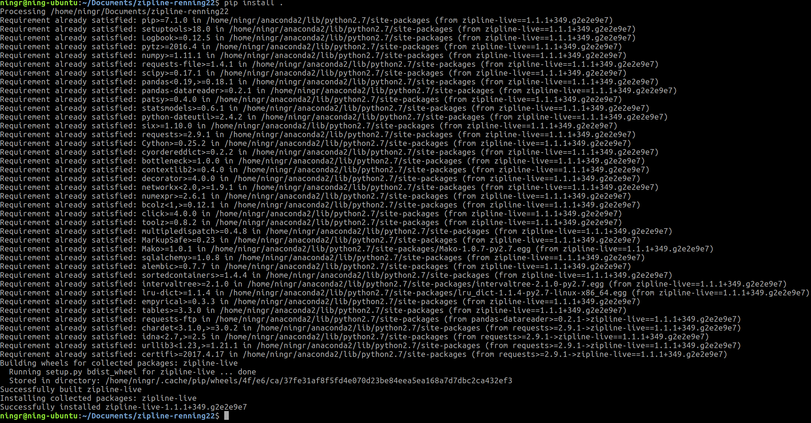
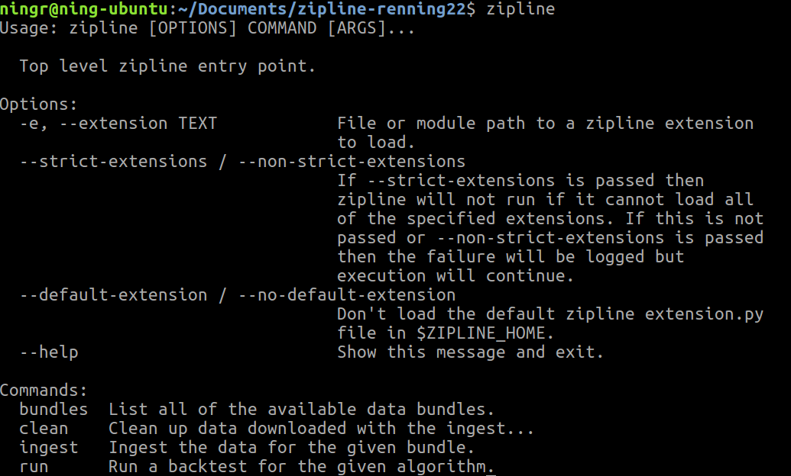
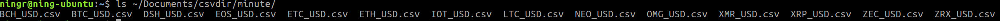
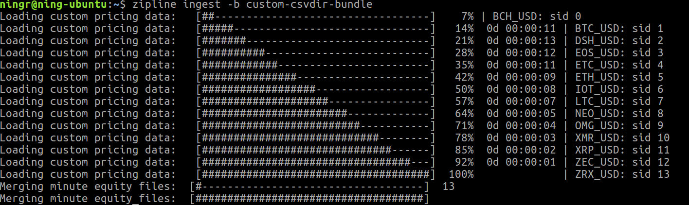
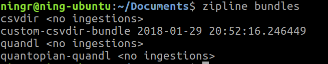
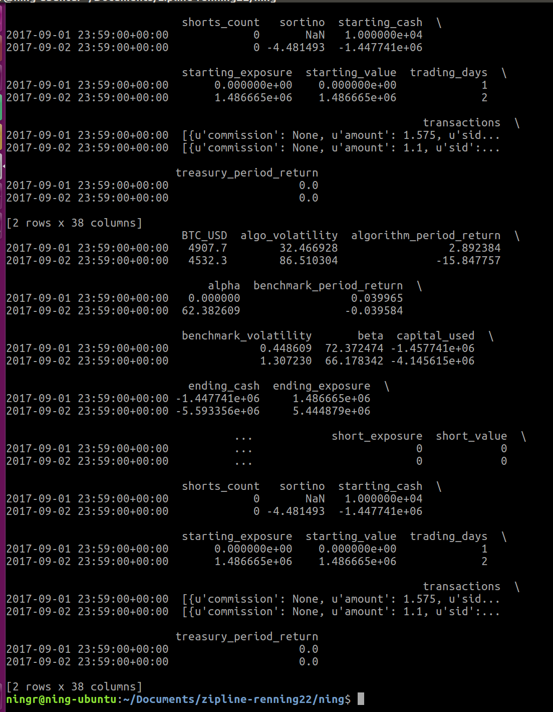
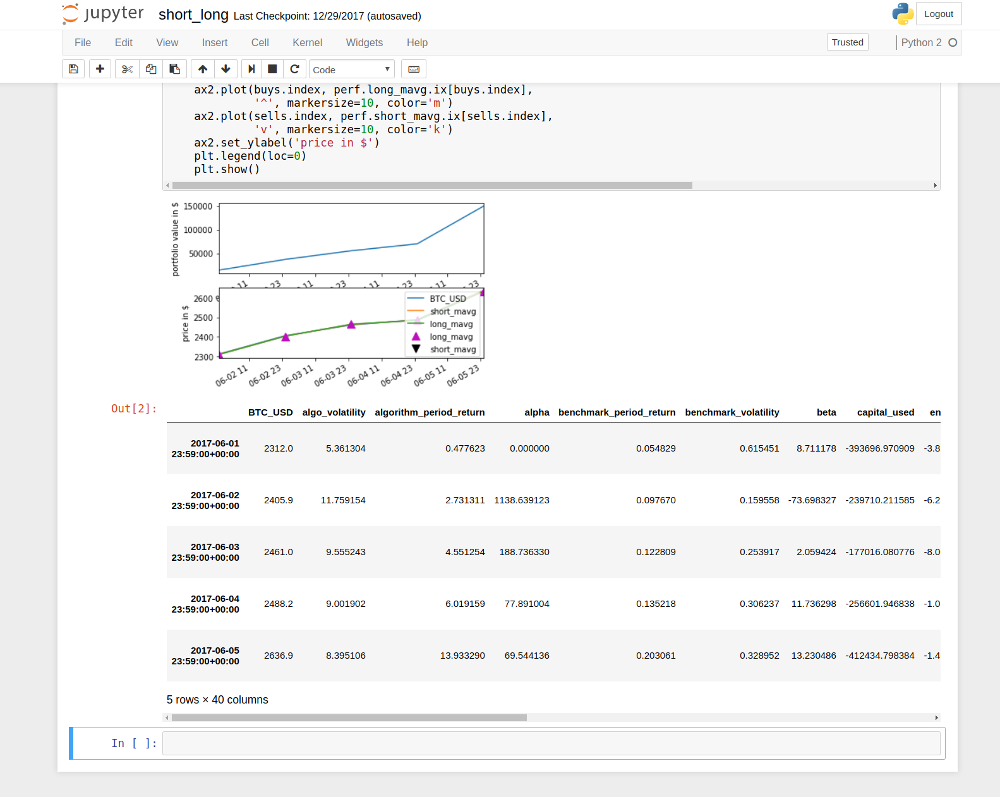

## Anaconda 2
1. Download and install Anaconda 2 (Python 2.7) from http://continuum.io/downloads.
2. Once set up, you can install the OFFICAL zipline by:

```bash
$ conda install -c Quantopian zipline
```
This will setup correct dependency environment.


## Clone & install
```bash
$ git clone https://github.com/renning22/zipline.git zipline-renning22
```

Keep in mind we are using 'live_crypto' branch.
```bash
$ cd zipline-renning22
$ git checkout live_crypto
```

Then run pip install under the 'zipline-renning22' git folder.
```bash
$ pip install .
```


## Check zipline is correctly installed
```bash
$ zipline
```


## Copy "extension.py" (for 7*24 calendar).
1. Copy "extension.py" to "~/.zipline/extension.py".
2. Edit "~/.zipline/extension.py", replace path "/home/ningr/Documents/csvdir" with your own home folder path, e.g. "/home/JJ/Documents/csvdir".

(You can find "extension.py" under "ning/" folder,)

## Data preparation
1. Download CSVs files from Dropbox:
https://www.dropbox.com/home/chives/zipline_data

2. Put them in your csvdir folder, e.g. "/home/JJ/Documents/csvdir", like:



## Data ingest
```bash
$ zipline ingest -b custom-csvdir-bundle
```
If data is correct ingested, you will see:


Run "zipline bundles" to check.
```bash
$ zipline bundles
```



## Backfill test in terminal
```bash
$ zipline run -f test_zipline.py -b custom-csvdir-bundle --start 2017-9-1 --end 2017-9-2 --trading-calendar TWENTYFOURSEVEN --data-frequency minute
```


(You can find "test_zipline.py" under "ning/" folder.)

## Backfill in IPython Notebook
1. In terminal run this to start the notebook service:
```
jupyter notebook
```

2. In web browser, go to "http://localhost:8888".

3. In notebook, run:

```python
%load_ext zipline
%pylab inline

%%zipline -b custom-csvdir-bundle --trading-calendar TWENTYFOURSEVEN --data-frequency minute --start 2017-9-1 --end 2017-9-2 --capital-base 10000 -o short_long_btc.pickle
```

## Sample to test if everything works.

[ning/short_long.ipynb]()

If everything is OK, the output should be:



## Examples:
See "ning/examples/" folder.
